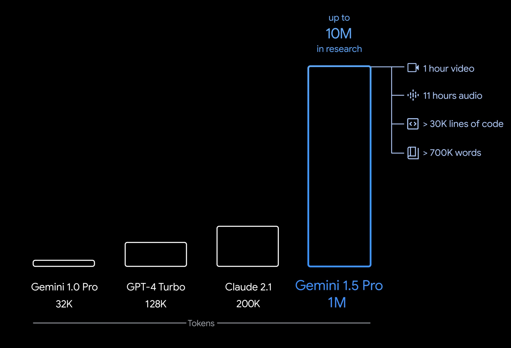

# Video_Summary
Summarizing a video using Gemini 1.5's 2M tokens long context capability.

---

## Requirements
1. pip install `google-generativeai`
2. [Gemini API Key](https://aistudio.google.com/app/apikey)

---

## Why Gemini ?
 Historically, large language models (LLMs) were significantly limited by the amount of text (or tokens) that could be passed to the model at one time. The Gemini 1.5 long context window, with near-perfect retrieval (>99%), unlocks many new use cases and developer paradigms.

 Using its insanely large 2 million token window, the model can "remember" the entire video at once, enabling tasks like generating comprehensive summaries, answering in-depth questions about specific scenes, identifying patterns across the video, performing detailed video-to-text analysis, and even creating complex, multi-turn dialogues about the video's content without losing context.

 